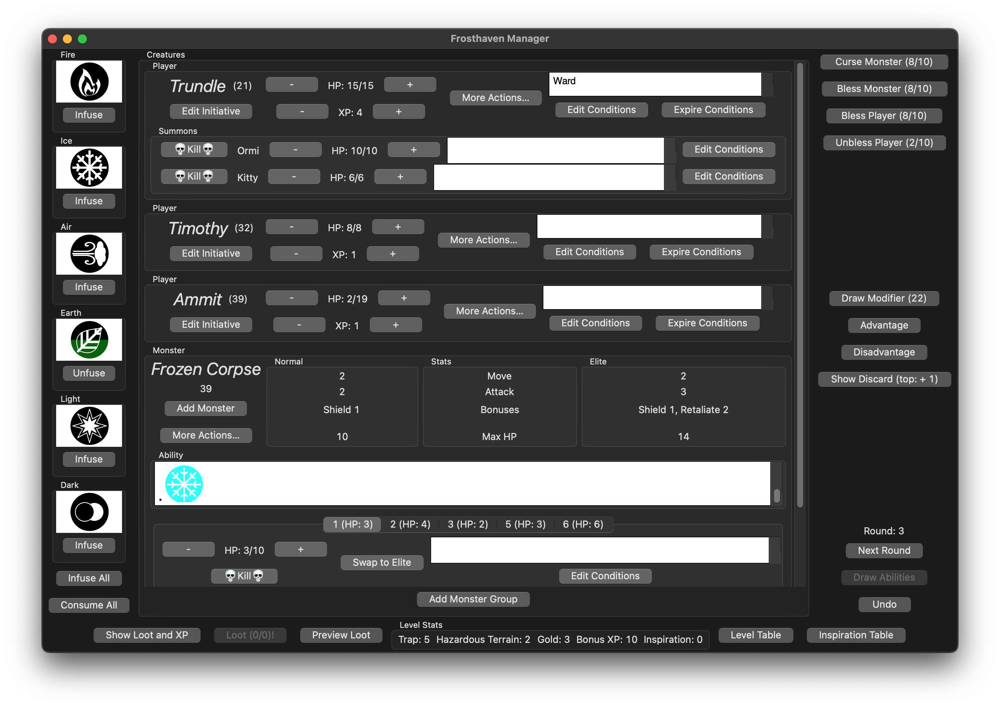

# Frosthaven Manager

GUI for running Frosthaven scenarios. For more details about the project see
[the documentation](https://benknoble.github.io/frosthaven-manager).

## Related Papers & Talks

- [Functional Shell and Reusable Components for Easy GUIs](https://racket.discourse.group/t/funarch-2023-functional-shell-and-reusable-components-for-easy-guis/2288),
  with [pre-formatted citation](https://benknoble.github.io/papers/)
    - [FUNARCH '23 talk](https://benknoble.github.io/workshops/gui-easy-funarch/)
- [14th RacketCon: Frosthaven Manager: Built by the Community](https://benknoble.github.io/workshops/14th-racket-con/)

## Screenshots

